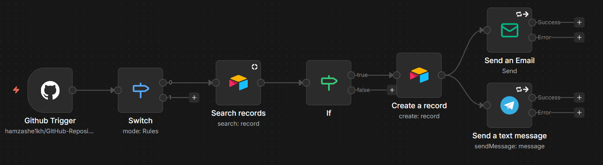

# GitHub Repository Engagement Tracker
#testing the bot hello


*Caption: The complete n8n orchestration workflow. It listens for GitHub events, filters logic based on event type, enforces idempotency via an Airtable lookup, and dispatches multi-channel notifications.*


*Caption: Live Demonstration: A user stars the repository, triggering the webhook. The workflow executes in real-time to validate the user, log the engagement to the database, and trigger the Telegram/Email alerts.*

## Overview
The **GitHub Repository Engagement Tracker** is a secure, event-driven automation pipeline designed to monitor and log open-source contributions. Unlike passive analytics dashboards, this system proactively listens for specific GitHub events (Stars and Pull Requests) to trigger immediate engagement loops.

The architecture prioritizes **data integrity** and **security**. It implements an idempotency gate to prevent duplicate logs (spam protection) and utilizes distinct error-handling paths to ensure that database records are preserved even if third-party notification APIs (Telegram/SMTP) experience downtime.

## Key Features
* **Event-Driven Architecture**: Utilizes GitHub Webhooks (push) rather than resource-heavy polling, ensuring the workflow only runs when actual engagement occurs.
* **Idempotency & Deduplication Logic**: Features a "Search -> If -> Create" logic gate. The system checks the database for an existing `Engagement ID` (Unique User + Event Combo) before logging data. This prevents bot spam or duplicate webhooks from corrupting the dataset.
* **Granular Event Filtering**: A Switch node validates incoming payloads, rigorously separating `star` (created) and `pull_request` (opened) events to ignore irrelevant actions like "un-stars" or "closed PRs."
* **Resilient Notification System**: The notification layer (Telegram & Email) is decoupled from the database layer. It features "Continue On Fail" logic, ensuring that a failure in the alerting system does not roll back the critical database transaction.
* **Secure API Handling**: Uses n8n's internal credential encryption and GitHub's Fine-Grained Personal Access Tokens (PAT) to enforce the Principle of Least Privilege.

## Tech Stack
* **Orchestration**: [n8n](https://n8n.io/) (Version 2.x)
* **Reverse Proxy / Tunneling**: [Ngrok](https://ngrok.com/) (Secure local webhook exposure)
* **Source Control**: GitHub (Webhooks & API)
* **Database**: [Airtable](https://airtable.com/)
* **Notifications**: Telegram Bot API & SMTP (Gmail App Password)

---

## Setup & Installation

### ⚠️ Important: Configuration & Sanitization
The `workflow.json` file included in this repository has been **sanitized** for security purposes. All personal API Keys, Token IDs, Database IDs, Chat IDs, and Email Addresses have been replaced with generic placeholders (e.g., `YOUR_EMAIL`, `appXXXXXXXX`).

**You must manually edit the nodes after importing the file to restore functionality.**

### 1. Backend Setup (n8n)
1. Open your n8n workspace.
2. Select **Import from File** and upload the `workflow.json` provided in this repository.
3. **Edit the Nodes**: Open the imported workflow and replace the following placeholder variables:
   * **GitHub Node**: Enter your `Owner` name and `Repository` name.
   * **Airtable Nodes**: Re-select your Base and Table from the dropdown menus (this replaces the sanitized IDs).
   * **Telegram Node**: Replace the placeholder `Chat ID` with your actual ID.
   * **Email Node**: Replace `your_email@gmail.com` with your actual sender/receiver address.
4. **Restore Credentials**: You must create new credentials in n8n for:
   * **GitHub API**: Use a Fine-Grained Token.
   * **Airtable API**: Use a Personal Access Token with `data.records:write` scopes.
   * **Telegram API**: Use the Bot Token provided by `@BotFather`.
   * **SMTP**: Use your email provider's SMTP settings. *Note: If using Gmail, you must use an App Password, not your login password.*

### 2. Database Setup (Airtable)
Create a new Airtable base with the following exact column headers (case-sensitive) to match the JSON mapping:
* `Engagement ID` (Single line text)
* `Username` (Single line text)
* `Event Type` (Single line text)
* `Repo Name` (Single line text)

### 3. Network Setup (Ngrok)
If you are running n8n locally (localhost), GitHub cannot reach your machine. You must use Ngrok to create a secure tunnel.

1. Install Ngrok and run the following command in your terminal:
```bash
   ngrok http 5678
```
2. Copy the forwarding URL (e.g., `https://your-url.ngrok-free.app`).
3. Start n8n using this webhook URL to ensure the triggers register correctly:
```bash
   export WEBHOOK_URL="https://your-url.ngrok-free.app"
   n8n start
```

---

## Usage & Testing

### Positive Logic Test (New Engagement)
1. Set the workflow to **Active** in n8n.
2. Go to the monitored GitHub repository.
3. Click **Star**.
4. **Result**: A new row appears in Airtable, and you receive alerts via Telegram and Email.

### Idempotency / Security Test (Spam Prevention)
1. Refresh the GitHub page (keeping the Star active) or simulate the webhook event again for the same user.
2. Check **n8n Executions**.
3. **Result**: The execution path will stop at the **If** node (False output), verifying that the system successfully blocked the duplicate entry and prevented spam notifications.
